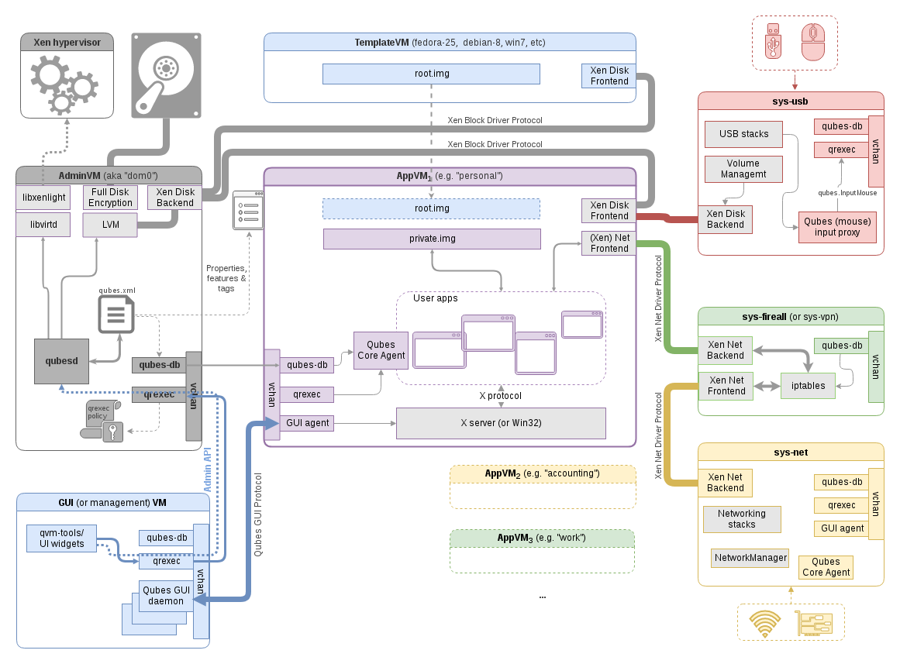

qubes-gui-daemon
================

gui-daemon is Qubes GUI Virtualisation agent/daemon, present on Dom0 side.

gui-daemon has default daemon setting. Starting the GUI will ask you whether to
start the daemon and you can then input the arguments as per what you would want
to install. The GUI domain would be the same as admin domain in all but few
scenarios. The gui-daemon is for Xorg. GUI daemon can be enabled for and run on
most OS from Linux/Xorg, Windows and MAcs.

The config is defined by guid.conf.

## Building qubes-gui-daemon

make `gui-daemon`

## What GUI Daemon has

- screen layout handler
- icon updater
